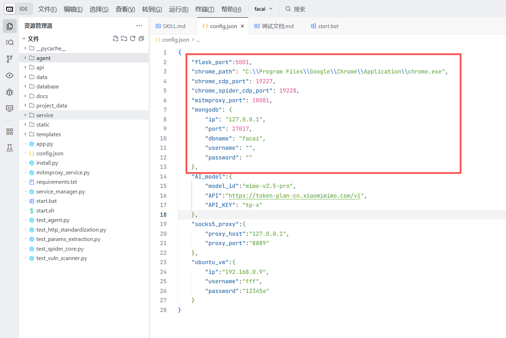
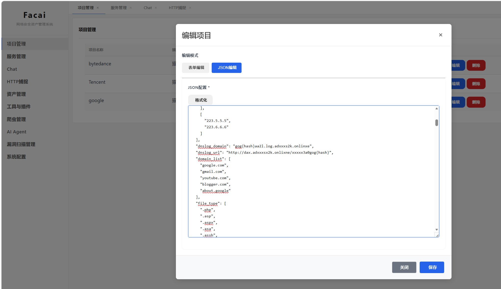
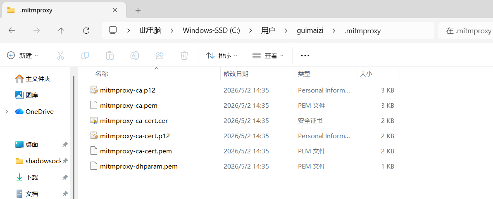
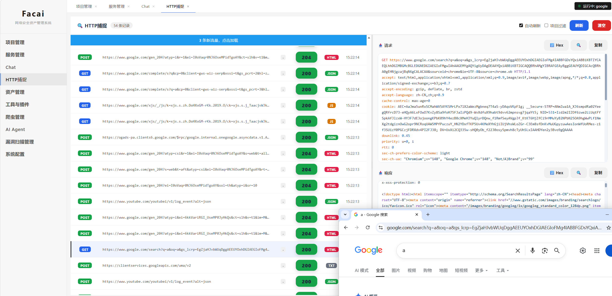
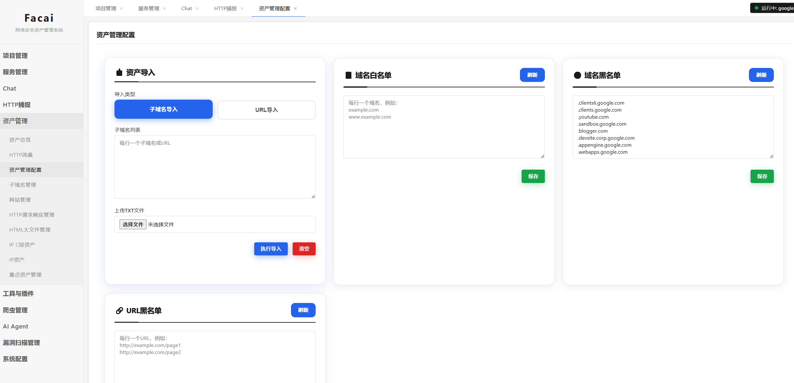

# facai网安工具

### 需要环境

**必须:**

* windows/linux/mac
* python3+
* mongodb数据库

**非必须：**

* chrome浏览器
* Ubuntu虚拟机
* 大模型API key，只要支持openai api格式都可以，覆盖qwen\glm\deepseek\gpt等等，几乎都可以。

### 安装步骤

**依赖安装**

```
python install.py
```


**配置工具配置文件**

```
{
    "flask_port":5001,
    "chrome_path": "C:\\Program Files\\Google\\Chrome\\Application\\chrome.exe",
    "chrome_cdp_port": 19227,
    "chrome_spider_cdp_port": 19228,
    "mitmproxy_port": 18081,
    "mongodb": {
        "ip": "127.0.0.1",
        "port": 27017,
        "dbname": "facai",
        "username": "",
        "password": ""
    },
    "AI_model":{
        "model_id":"mimo-v2.5-pro",
        "API":"https://token-plan-cn.xiaomimimo.com/v1",
        "API_KEY": "tp-x"
    },
    "socks5_proxy":{
        "proxy_host":"",
        "proxy_port":""
    },
    "ubuntu_vm":{
        "ip":"192.168.0.9",
        "username":"fff",
        "password":"12345a"
    }
}
```





**图画圈的是必填项。**


**之后运行python app.py添加项目**


```
{
  "Description": "描述",
  "Project": "google",
  "_id": "6a12d17bbe5110aa509359c3",
  "browser_thread": 10,
  "clipboard_text": [
    "asdsa"
  ],
  "created_at": "2026-05-24 18:22:51",
  "dns_server": [
    [
      "119.29.29.29",
      "119.28.28.28"
    ],
    [
      "180.76.76.76",
      "180.76.76.76"
    ],
    [
      "180.184.1.1",
      "180.184.2.2"
    ],
    [
      "114.114.114.114",
      "114.114.115.115"
    ],
    [
      "223.5.5.5",
      "223.6.6.6"
    ]
  ],
  "dnslog_domain": "gog{hash}aa2l.log.adxxxs2k.onlinxe",
  "dnslog_url": "http://dax.adxxxsx2k.onlixne/xxxxx3a0gog{hash}",
  "domain_list": [
    "google.com",
    "gmail.com",
    "youtube.com",
    "blogger.com",
    "about.google"
  ],
  "file_type": [
".php", ".asp", ".aspx", ".asa", ".assh", ".jsp", ".jspx", ".do", ".action", ".py", ".cgi", ".htm", ".html", ".fcg", ".fcgi", ".xhtml", ".shtml", ".shtm", ".rhtml", ".rhtm", ".jhtml", ".jhtm", ".pl", ".php3", ".php4", ".php5", ".phtml", ".pht", ".phar", ".phpt", ".phs", ".ph7"
  ],
  "file_type_disallowed": [".3g2", ".3gp", ".7z", ".aac", ".abw", ".aif", ".aifc", ".aiff", ".arc", ".au", ".avi", ".azw", ".bin", ".bmp", ".bz", ".bz2", ".cmx", ".cod", ".csh", ".css", ".csv", ".doc", ".docx", ".eot", ".epub", ".gif", ".gz", ".ico", ".ics", ".ief", ".jar", ".jfif", ".jpe", ".jpeg", ".jpg", ".m3u", ".mid", ".midi", ".mjs", ".mp2", ".mp3", ".mp4", ".mpa", ".mpe", ".mpeg", ".mpg", ".mpkg", ".mpp", ".mpv2", ".odp", ".ods", ".odt", ".oga", ".ogv", ".ogx", ".otf", ".pbm", ".pdf", ".pgm", ".png", ".pnm", ".ppm", ".ppt", ".pptx", ".ra", ".ram", ".rar", ".ras", ".rgb", ".rmi", ".rtf", ".snd", ".svg", ".swf", ".tar", ".tif", ".tiff", ".ttf", ".vsd", ".wav", ".weba", ".webm", ".webp", ".woff", ".woff2", ".xbm", ".xls", ".xlsx", ".xpm", ".xul", ".xwd", ".zip", ".exe", ".apk", ".msi", ".dmg", ".rpm", ".deb", ".pkg", ".ios", ".iso", ".txt", ".m3u8", ".tgz", ".md", ".xml", ".dll"
  ],
  "http_thread": 10,
  "personal_info": {
  },
  "port_target": "21,22,80-89,443,1080,1433,1521,3000,3306,3389,5432,5900,6379,7001,8000,8069,8080-8099,8161,8888,9080,9081,9090,9200,9300,10000-10002,11211,11434,27016-27018,36000,50000,50070",
  "service_lock": {
    "monitor_service": 0,
    "scaner_service": 0,
    "spider_cdp_service": 1,
    "spider_service": 1
  },
  "status_code": 1,
  "timeout": 8,
  "user_agent": "Mozilla/5.0 (Windows NT 10.0; Win64; x64) AppleWebKit/537.36 (KHTML, like Gecko) Chrome/146.0.0.0 Safari/537.36 Edg/146.0.0.0"
}
```

**Project字段， 必须英文，这是项目标识符，也是数据库建表要用的。**

**domain_list字段 就是你的目标范围，比如google.com x.com**   必须是域名。

之后结束python app.py


**安装证书:**



```
C:\Users\guimaizi\.mitmproxy    替换成你主机的用户名，安装证书, mitmproxy-ca-cert.cer   
```


启动chrome，如burp或者fiddler之类工具同样设置，把流量转发至facai工具。




**项目启动**

start.bat 或者start.sh即可。


通过chrome 访问domain_list范围内, 即可开始收集资产。



或者通过子域名\url导入也可。

### 总结

**总归一句话，你正常chrome浏览网页，甚至说你把某软件的http流量转发过来，xss\sql\ssrf\rce都在后台自动检测，你设置的域名范围内资产也都一块收集了。**

发财，都发财，爬虫与AI功能暂不开放。

技术交流、pro版、定制魔改，作者联系方式wechat: guimaizi

**本项目仅供学习和研究使用，请勿用于非法用途。**

### 欢迎打赏


